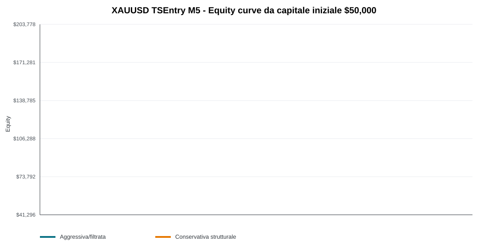
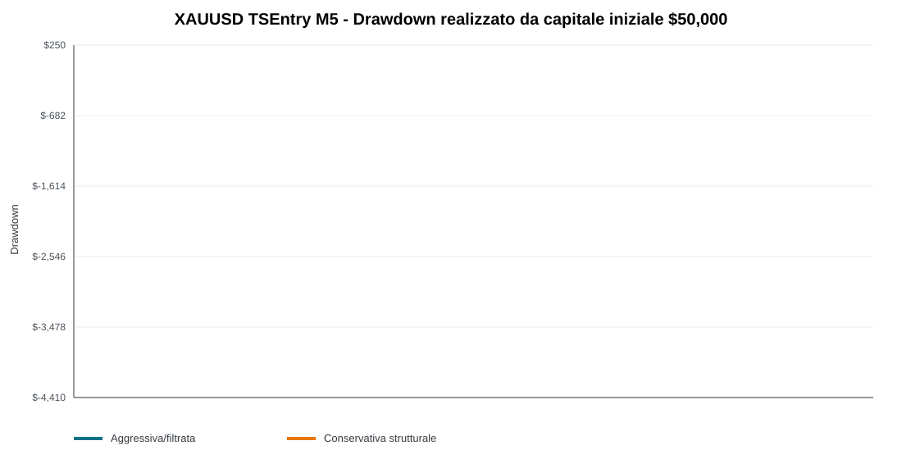

# XAUUSD TSEntry M5 - Rappresentazione grafica su conto da 50.000$

Questo report ricalcola l'ultimo split/OOS test assumendo capitale iniziale `50.000$` e rischio fisso `1%` per trade. Quindi `1R = 500$`.
Le medie mensili/annuali sono medie semplici sul capitale iniziale, non una simulazione compounding con size crescente.

## Curve

## Tabella sintetica

| Famiglia | Trade | Trade/settimana | Trade/giorno attivo | Winrate | PF | Guadagno medio/mese | Guadagno medio/anno | DD giornaliero max | DD max | Capitale finale |
| --- | ---: | ---: | ---: | ---: | ---: | ---: | ---: | ---: | ---: | ---: |
| Aggressiva/filtrata | 236 | 0.85 | 1.28 | 61.02% | 4.22 | $2,259 (4.52%) | $27,104 (54.21%) | $-500 | $-4,161 (-8.32%) | $195,073 |
| Conservativa strutturale | 222 | 0.79 | 1.59 | 59.46% | 3.33 | $1,530 (3.06%) | $18,363 (36.73%) | $-1,000 | $-3,000 (-6.00%) | $148,289 |

## Altri dati utili

| Famiglia | Periodo trade | Trade/giorno calendario | Avg profit/trade | CAGR indicativo | Best month | Worst month | Best year | Worst year | Total return |
| --- | --- | ---: | ---: | ---: | ---: | ---: | ---: | ---: | ---: |
| Aggressiva/filtrata | 2021-01-06 -> 2026-05-14 | 0.121 | $615 | 28.96% | $15,145 | $-2,000 | $35,814 | $7,464 | 290.15% |
| Conservativa strutturale | 2021-01-06 -> 2026-05-14 | 0.114 | $443 | 22.52% | $8,407 | $-1,369 | $27,011 | $5,192 | 196.58% |

## Lettura sintetica

- Aggressiva/filtrata chiude a circa `$195,073` da 50.000$, con PF `4.22` e DD massimo `-8.32%`.
- Conservativa strutturale chiude a circa `$148,289` da 50.000$, con PF `3.33` e DD massimo `-6.00%`.
- Il DD giornaliero è calcolato su drawdown realizzato da trade chiusi per giornata New York, non su floating intraday tick-by-tick.
- Queste metriche sono su Dukascopy BID OHLC senza commissioni/slippage espliciti oltre al buffer sweep; prima della demo MT5 serve applicare costi broker realistici.

## File sorgente

- Trade list locale ignorata: `data/backtests/TSENTRY_XAUUSD_M5_daytrading_split_oos_trades_20260612.csv`
- Summary locale ignorato: `data/backtests/TSENTRY_XAUUSD_M5_daytrading_split_oos_50k_summary_20260612.csv`
